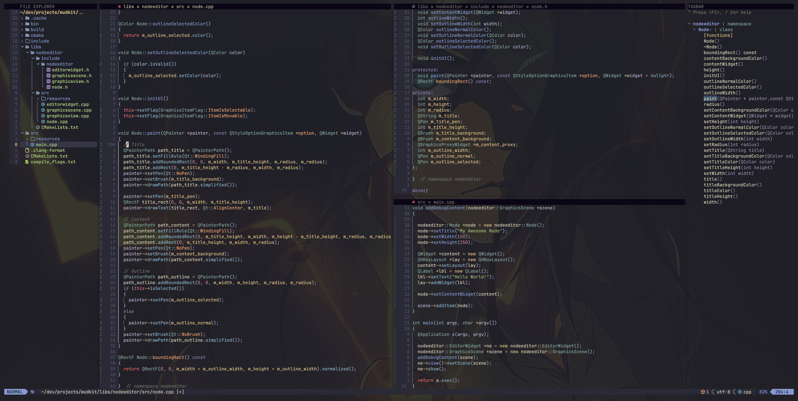
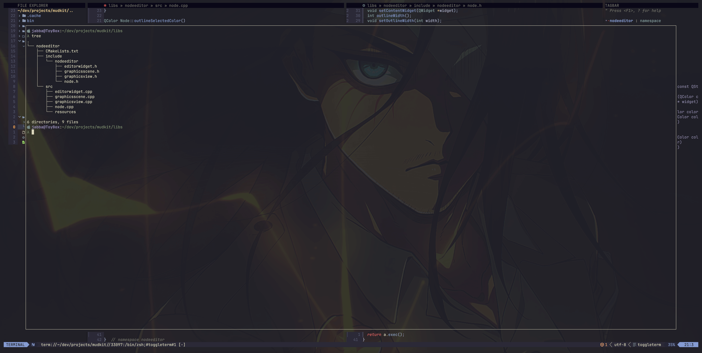

## Jabba's Dotfiles

### Neovim C/C++ Development Environment
#### _(MacOS/Linux/Windows)_

#### Preview

Neovim Editor:


Floating Terminal:


### Kitty Terminal Configuration

The Kitty terminal configuration is intended for MacOS and Linux only. The background image shown in the above previews is part of the Kitty configuration.  Should you wish to use the background image in your own terminal, it is located in the [.dotfiles/.config/kitty/kitty-themes](https://github.com/jabbathenut/.dotfiles/tree/main/.config/kitty/kitty-themes) folder.

* In Windows Terminal, you can set the background image as follows:
    * Copy the background image to a Windows folder of your choosing
    * In Windows Terminal, go to Settings>>Defaults>>Appearance
    * Change the Background image path to your chosen path for the background image
    * Change the Background image opacity to your preferred level.
        * To match this configuration, use an opacity value of 10%

_Please Note: This configuration has only been tested on MacOS. The background image, however, has been used in Windows Terminal as described above._

### Starship Terminal Prompt Configuration

The Starship configuration is intended for MacOS, Linux and Windows.
* Install Starship on your OS as per the instructions provided at [starship.rs](https://starship.rs/)
    * Be sure to add the required entry to your preferred shell (e.g., add ```eval "$(starship init zsh)"``` to .zshrc)
* On Windows, do the following:
    * Place the starship.toml configuration file (located in the .config folder of this repository) in a ~/.config folder on Windows (you will likely need to create the folder)
    * If you are using Windows Terminal, you need to set the color scheme and font face.
        * Copy the JSON color schemes from [rebelot/kanagawa.nvim](https://github.com/rebelot/kanagawa.nvim/blob/master/extras/windows_terminal.json) 
        * Paste the color schemes into the Windows Terminal settings JSON file
            * Select Settings from Windows Terminal
            * Select Open JSON File
            * Paste the color schemes into the section entitled "schemes"
        * In Settings>>Defaults>>Appearance, select the following:
            * Color scheme = Kanagawa Wave
            * Font face = JetBrainsMono Nerd Font

_Please note: this configuration has only been tested on MacOS and Windows._

### Neovim C/C++ Configuration

This is my personal Neovim configuration for C/C++. While it works well for me and my workflow, it may not be what you expect or prefer. Please use this configuration with that in mind.

_Please Note:  The background image and terminal prompt styling shown in the above previews are not part of the Neovim configuration. They are part of the Kitty and Starship configurations, respectively._

#### Language Features

* LSPs: clangd, cmake-language-server and lua-language-server
    * Includes clang-tidy support with clangd
    * Managed with [williamboman/mason.nvim](https://github.com/williamboman/mason.nvim), [williamboman/mason-lspconfig.nvim](https://github.com/williamboman/mason-lspconfig.nvim) and [WhoIsSethDaniel/mason-tool-installer.nvim](https://github.com/WhoIsSethDaniel/mason-tool-installer.nvim)
* LSP Completion: [hrsh7th/nvim-cmp](https://github.com/hrsh7th/nvim-cmp)
* Language Formatting and Linting: [nvimtools/none-ls.nvim](https://github.com/nvimtools/none-ls.nvim)
    * Formatters include: clang-format, cmake-format and stylua
    * Linters include: cmakelint
    * C++ diagnostics done by clangd using clang-tidy
* Ctags Tagbar: [preservim/tagbar](https://github.com/preservim/tagbar)

_Please Note: clangd is being used for LSP completion, diagnostics and formatting. To achieve this, it requires the presence of either a compile_commands.json file or a compile_flags.txt file in your project. For more information, please refer to the following link: [clangd Getting Started](https://clangd.llvm.org/installation.html#project-setup)._

#### Other Features

* Uses Lazy.nvim Plugin Manager
* Foundational Features:
    * Fuzzy Finder: [nvim-telescope/telescope.nvim](https://github.com/nvim-telescope/telescope.nvim)
    * File Explorer: [nvim-tree/nvim-tree](https://github.com/nvim-tree/nvim-tree.lua)
    * Syntax Highlighting: [nvim-treesitter/nvim-treesitter](https://github.com/nvim-treesitter/nvim-treesitter), []
    * Easy Terminal Access: [akinsho/toggleterm](https://github.com/akinsho/toggleterm.nvim)
    * Statusline: [nvim-lualine/lualine.nvim](https://github.com/nvim-lualine/lualine.nvim)
* LSP-Based Code Folding: [kevinhwang91/nvim-ufo](https://github.com/kevinhwang91/nvim-ufo)
* Realtime Markdown Preview: [iamcco/markdown-preview.nvim](https://github.com/iamcco/markdown-preview.nvim)
* Enhanced Diagnostics Navigation: [folke/trouble.nvim](https://github.com/folke/trouble.nvim)
* Custom Winbars
    * File, Explorer and Tagbar Headers
    * Indicator for Modified File
* Dynamic Key Binding Popup Support: [folke/which-key.nvim](https://github.com/folke/which-key.nvim)
* Theme: kanagawa [rebelot/kanagawa.nvim](https://github.com/rebelot/kanagawa.nvim.git)
* And more...

#### Clang-Format
I have included a complete .clang-format file in the root dotfiles directory. It represents my C++ code format style. It is based mostly on the LLVM style, with a blend of the Microsoft style (e.g., brace wrapping and column limit) and a very minor dash of Google styles that differs from LLVM.
* For convenience, I broke the file into two sections: 1) Modified Settings and 2) Remaining Default Settings.
    * The Remaining Default Settings section contains the LLVM default values.
    * The Modified Settings section contains a blend of Microsoft and Google style values.
    * To use it, simply copy the file to the root folder of your desired C++ project.

#### Dependencies
The following software needs to be installed before applying this Neovim configuration:

##### _MacOS_
* Install Xcode and the Command Line Tools
    * Install XCode form the App Store
    * From the command line, enter: ```xcode-select --install```
* Install the following Homebrew packages (adjust for your package manager):
    * clang-format
    * cmake
    * ripgrep
    * tree-sitter
    * universal-ctags
    * node
    * yarn
    * neovim
    * font-jetbrains-mono-nerd-font (you can use a different nerd font, if you like)

##### _Windows_
The Windows installation is easy, but requires some not-so-obvious details. Consequently, I am providing direct installation instructions for each of the required software. You can, however, choose to use your preferred package manager such as: Scoop, Winget or Chocolatey.

Visual Studio ([https://visualstudio.microsoft.com](https://visualstudio.microsoft.com))
* Install Visual Studio as per standard instruction (e.g., Visual Studio Community Edition)
    * Be sure to select the workload entitled "Desktop development with C++"

7-Zip ([https://www.7-zip.org](https://www.7-zip.org))
* Do a standard installation
* After installation, move the Uninstall.exe file from C:\Program Files\7-Zip to another location, such as a newly created subdirectory (e.g., C:\Program Files\7-Zip\Uninstall). This is intended to hide the file from view when you add 7-Zip to the PATH in the next step.
* Add C:\Program Files\7-Zip to your system PATH.

Git ([https://git-scm.com/downloads](https://git-scm.com/downloads))
* Install as per standard instruction

Python (current version ok - minimum version 3.9.13) ([https://www.python.org/downloads/](https://www.python.org/downloads/))
* Do a full installation (including pip, etc.)
* After the installation, run the following from the command line (virtual environment capability is required by Mason to install some of the configuration packages):
   * ```pip install virtualenv```
   * ```pip install virtualenvwrapper-win```

CMake ([https://cmake.org/download](https://cmake.org/download))
* Install as per standard instruction, but make sure to add to system PATH

Universal Ctags ([https://github.com/universal-ctags/ctags-win32/releases](https://github.com/universal-ctags/ctags-win32/releases))
* Download ctags-vX.X.X-x64.zip
* Extract the contents to C:\ProgramsOther\UniversalCtags (or any other location you prefer)
* Add C:\ProgramsOther\UniversalCtags to your system PATH

RipGrep ([https://github.com/BurntSushi/ripgrep/releases](https://github.com/BurntSushi/ripgrep/releases)
* Download ripgrep-X.X.X-i686-pc-windows-msvc.zip
* Extract the contents to C:\ProgramsOther\RipGrep (or any other location you prefer)
* Add C:\ProgramsOther\RipGrep to your system PATH

Nerd Font ([https://www.nerdfonts.com/font-downloads](https://www.nerdfonts.com/font-downloads))
* Download JetBrainsMono.zip (or whichever nerd font you prefer)
* Extract the contents to a temporary directory
* Select all of the .ttf files, right click, then select Install

LLVM ([https://github.com/llvm/llvm-project/releases](https://github.com/llvm/llvm-project/releases))
* Download LLVM-X.X.X-win64.exe and install as per standard instruction
   * Make sure to select "Add LLVM to the system PATH for all users" during installation
* This installation includes clang, clangd, clang-format, clang-tidy, etc.
* This installation is intended to be used by the Neovim configuration for completion, diagnostics and formatting. It is not intended to replace, or otherwise conflict with, your Microsoft Visual Studio build system.

Node.js and Yarn ([https://nodejs.org/en/download](https://nodejs.org/en/download))
* Download node-X.X.X-x64.msi and install as per standard instruction
* After installing Node.js, run the following from the command line to install Yarn:
    * ```npm install --global yarn```

Neovim ([https://github.com/neovim/neovim/releases](https://github.com/neovim/neovim/releases))
* Download and install nvim-win64.msi

Neovim Configuration Files
* Place the nvim folder (located in the .config folder of this repository) in the following Windows user folder:
    * ~/AppData/Local
